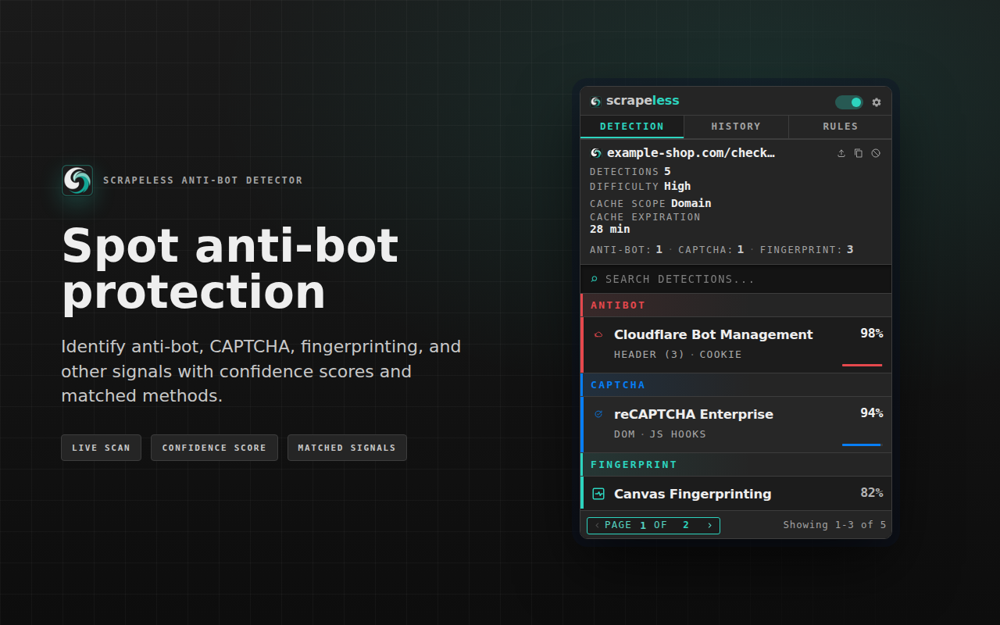
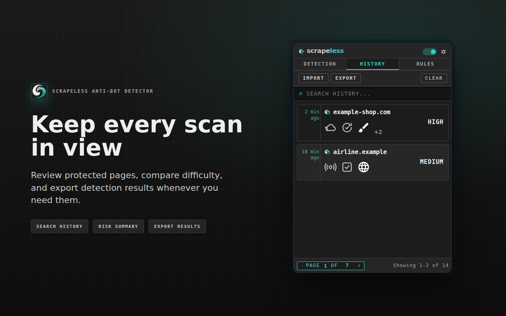
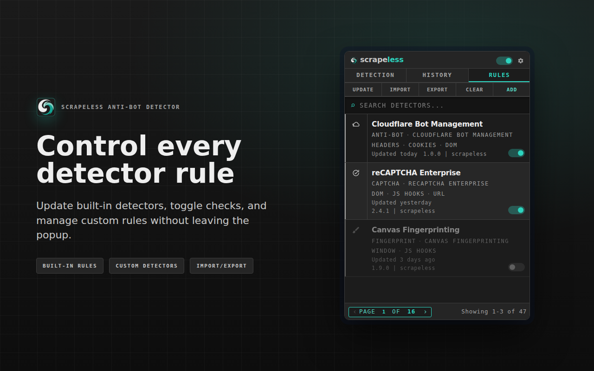
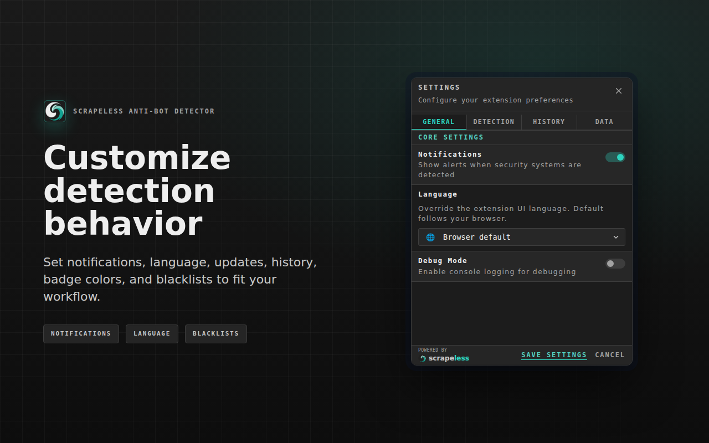

# Scrapeless Anti-bot Detector

<div align="center">


<br>




<br>

**Detect anti-bot systems, CAPTCHAs & browser fingerprinting in real-time**

[Scrapeless](https://www.scrapeless.com/en)

</div>

---

## Overview

Open a page and the extension tells you what is watching you: which anti-bot
vendor is deployed, which CAPTCHA is armed, and which fingerprinting APIs the
page actually touched while it loaded. 44 detectors ship enabled, and you can
edit any of them or add your own without leaving the console.

| | Detectors | Covers |
|---|---|---|
| **Anti-bot / WAF** | 15 | Cloudflare Bot Management, Akamai, DataDome, PerimeterX, Kasada, Shape Security, AWS WAF, Imperva, F5 BIG-IP ASM, Reblaze, Sucuri, ThreatMetrix, Cheq, Ocule, Meetrics |
| **CAPTCHA** | 8 | reCAPTCHA, hCaptcha, FunCaptcha (Arkose), GeeTest, Friendly Captcha, Captcha.eu, QCloud, AliExpress |
| **Fingerprinting** | 21 | Canvas, WebGL, Audio, Font, WebRTC, Navigator, Screen, Hardware, Timezone, Battery, Gamepad, USB, Clipboard, Geolocation, Media, Crypto, CSS, IndexedDB, Web Storage, Performance, Device Orientation |

## Screenshots

| History | Detectors | Settings |
|---------|-------|----------|
|  |  |  |

## Features

### Eight kinds of signal, not just markup

Most detectors match on more than one, and each states which it uses. The
counts are how many of the 44 shipped detectors rely on each:

| Signal | Used by | What it sees |
|---|---|---|
| Page content | 30 | inline scripts, markup, embedded tokens |
| Window properties | 25 | vendor objects left on the global scope |
| JS hooks | 21 | fingerprinting APIs *as they are called* |
| Request URLs | 19 | vendor endpoints and challenge paths |
| Cookies | 9 | session and challenge cookies |
| DOM | 6 | elements, classes, iframes |
| Headers | 2 | response headers |
| Request payloads | 1 | POST/PUT bodies, filtered by URL and method |

The JS hooks are the part that markup scraping cannot do. They install
synchronously at `document_start`, before page scripts run, so a fingerprinting
call is caught *at the moment it happens* rather than inferred from a script tag
that may never have executed. Which APIs get hooked is driven entirely by the
detector definitions — adding a hook means editing a detector, not the extension.

### The catalogue is yours

Every detector is a JSON file you can read, edit, disable, or fork in the Detectors
pane — conditions, confidence, category and colour included. Nothing is compiled
in. Conditions are evaluated by a pre-built matcher, never `eval`, so a detector you
write cannot execute arbitrary code.

### Analytics over your own scan history

A separate board charts what you have actually run into: detections over time,
category split, vendor ranking, bypass difficulty, confidence spread, which
signal gave each vendor away, and which vendors appear together on one page.
It reads your local history, and you can export it as JSON or PDF.

### Nine SDKs

Ask the same question from a script: `isAntibot()`, `isCaptcha()`,
`isFingerprinted()`. Browser JavaScript hears the extension directly; Node,
Python, Go, Java, C#, Ruby, PHP and Rust drive a real Chrome with the extension
loaded. See [scrapeless-sdks/](scrapeless-sdks).

### Twelve languages

The console and the analytics board are fully localized — English, Spanish,
Portuguese (BR), French, German, Italian, Russian, Japanese, Korean, Chinese
(Simplified), Arabic and Hindi. 653 keys, checked for parity across all twelve.

### It stays on your machine

- **No telemetry and no account.** Nothing is reported anywhere about what you
  browse, and there is nothing to sign into. Detection itself runs entirely in
  your browser.
- **The outbound requests it can make are all yours to trigger**: fetching page
  resources while scanning, sharing a result as a link, firing a webhook you
  configured, and syncing the detector catalogue — which is **off by default**
  (`catalogSync.autoSync: false`) and updates only when you ask.
- **Eight permissions**, all load-bearing — no `scripting`, no `webNavigation`.
- **CSP-clean**: no inline handlers, no `unsafe-eval`.
- **World isolation** between the MAIN-world probe and the extension's own
  context, bridged by an authenticated channel rather than shared globals.
- **12-hour result cache** (configurable, scoped per domain), with an LRU of
  compiled patterns so repeat scans skip recompilation.

## Usage

### Basic Detection

1. **Navigate to a Website**: The extension automatically scans pages
2. **Open Popup**: Click the extension icon to view results
3. **View Details**: Click on any detection card to see full details
4. **Copy Results**: Use the copy button to export detection data

### Detectors Editor

1. **Browse Detectors**: View every detector by category (Anti-Bot, CAPTCHA, Fingerprinting)
2. **Edit Detectors**: Modify detection patterns, confidence scores, and settings
3. **Add Methods**: Create new detection methods (Cookie, Header, URL, Content, DOM, Window, JS Hooks, Payload)
4. **Pattern Options**: Configure regex, whole-word, and case-sensitive matching
5. **Import/Export**: Share detectors via JSON files

### Settings

- **Cache Duration**: Set detection cache expiry (1-24 hours)
- **History Limit**: Control max history items (10-500)
- **URL Blacklist**: Exclude specific domains from detection
- **Debug Mode**: Enable verbose logging to Service Worker console
- **Auto-cleanup**: Automatic history expiration

## SDKs

The extension pushes `CustomEvent`s at `window` when the *Page signals* setting is
on. `scrapeless-sdks/browser/scrapeless-detector.js` wraps that into something you can ask:

```js
const sdk = new ScrapelessDetector();

if (await sdk.isAntibot()) {
  console.log('this page runs an anti-bot system');
}

const result = await sdk.detect();
// { available, url, total, categories: { antibot, captcha, fingerprint, other }, detections: [...] }
```

Zero dependencies, single UMD file — script tag, `require`, or a bundler.

| Method | Returns |
|--------|---------|
| `ready()` | `{ available, version }` once the extension announces itself |
| `detect()` | the full result; replays if detection already finished |
| `isAntibot()` / `isCaptcha()` / `isFingerprinted()` | `boolean` |
| `isProtected()` | `boolean` — anything, any category |
| `snapshot()` | last result synchronously, or `null` |
| `on(event, fn)` | subscribe; returns an unsubscribe function |

### The other eight

Same questions, from a scraper. No language outside a page can hear the
extension — there is no `window` — so each of these drives a real Chrome with
the extension loaded and reads the answer back out of the document.

```python
async with ScrapelessDetector.launch("scrapeless-extension") as session:
    result = await session.detect("https://example.com/checkout")
    if result.is_antibot:
        print([d.name for d in result.of_category("antibot")])
```

```go
result, err := scrapeless.DetectURL(ctx, "https://example.com/checkout",
    scrapeless.Options{ExtensionPath: "scrapeless-extension"})
```

| SDK | Driver | Tests |
|---|---|---|
| `browser/` | — hears the events directly | in the extension's own suite |
| `node/` | Playwright | 12 |
| `python/` | Playwright | 22 |
| `java/` | Playwright for Java | 77 assertions |
| `csharp/` | Microsoft.Playwright | 75 assertions |
| `ruby/` | playwright-ruby-client | 11 / 74 assertions |
| `php/` | php-webdriver + CDP | 62 assertions |
| `rust/` | chromiumoxide (optional feature) | 5 |
| `go/` | chromedp | 13 |

All nine fold detection categories identically, and that is enforced rather
than trusted: every SDK's tests read the same
[`conformance.json`](scrapeless-sdks/conformance.json), and each embeds the same
[`bridge.js`](scrapeless-sdks/bridge.js), with a drift check asserting the eight
copies stay byte-identical. See [scrapeless-sdks/](scrapeless-sdks).

Two things worth knowing:

- **Page signals ships off.** The user must enable *Settings → Detection → Page
  signals*, and the extension may not be installed at all. Neither is
  distinguishable from "nothing detected" by listening, so every wait is bounded
  and resolves with `available: false` rather than hanging. **Check `available`
  before trusting a `false`.**
- **Categories are normalized for you.** The bundled detectors spell the category
  four different ways — `Anti-Bot`, `ANTIBOT`, `CAPTCHA`, `Fingerprint` — so a raw
  `d.category === 'antibot'` matches nothing. Use `categoryKey` or the `is*()`
  helpers.

Full reference: [scrapeless-sdks/README.md](scrapeless-sdks/README.md).

## Architecture

### Project Structure

```
scrapeless-antibot-detector/
├── scrapeless-extension/         # The extension itself — load THIS folder unpacked
│   ├── manifest.json             # Manifest V3 configuration
│   ├── console.html              # Console document and script composition
│   ├── analytics.html            # Analytics document
│   ├── src/
│   │   ├── entry/                # Worker, isolated-page, main-world and Console entrypoints
│   │   ├── contracts/            # Stable wire contracts shared across runtime contexts
│   │   ├── foundation/           # Locale, storage, telemetry, formatting and lifecycle services
│   │   ├── scanning/             # Detector catalog, matching engine and hook orchestration
│   │   ├── worker/               # Service-worker routes, sessions and network coordination
│   │   ├── probe/                # MAIN-world instrumentation
│   │   └── console/              # Findings, archive, policies and preferences UI slices
│   ├── detectors/                # Stable JSON detector IDs and schemas
│   ├── presentation/             # Console stylesheets
│   ├── _locales/                 # UI strings, 12 languages
│   └── brand/                    # Packaged extension artwork
├── scrapeless-sdks/              # nine SDKs, one shared conformance suite
│   ├── browser/                  # page JavaScript — hears the extension directly
│   ├── node/  python/  go/       # Playwright, Playwright, chromedp
│   ├── java/  csharp/  ruby/     # each drives Chrome with the extension loaded
│   ├── php/   rust/
│   ├── conformance.json          # shared vectors every SDK's tests read
│   └── bridge.js                 # canonical listener every SDK embeds
└── store-media/                  # Store-listing screenshots; not part of the extension
```

`scrapeless-extension/` is the complete, self-contained extension: nothing outside it is loaded at runtime, so packaging is just zipping that one folder.

## Development

No build step and no dependencies — it is plain JavaScript, so the folder you
load is exactly what ships:

1. Open `chrome://extensions/`
2. Enable **Developer mode** (top-right)
3. **Load unpacked** → select the `scrapeless-extension/` folder (not the repository root)
4. After changes, click the reload icon on the extension card

`scrapeless-extension/` is self-contained: nothing outside it is loaded at
runtime, so packaging for the store is just zipping that one folder.

## License

**Copyright (c) 2026 Scrapeless.** Licensed under the **Non-Profit Open Software
License 3.0 (NPOSL-3.0)**.

See [NOTICE.md](NOTICE.md) for what this project is and what it contains.

### Full License

See the [LICENSE](LICENSE) file for complete terms and conditions.

---

<div align="center">

</div>
